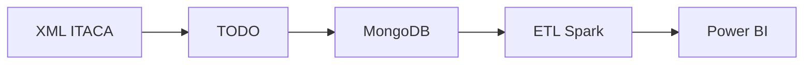

# Proyecto 01 · [ITACA]

## Descripción y objetivo

Construir un dashboard de análisis académico en Power BI a partir de datos reales de la plataforma ITACA de la Conselleria de Educación, extraídos como ficheros XML.

## Arquitectura

*Diagrama del pipeline completo.*

